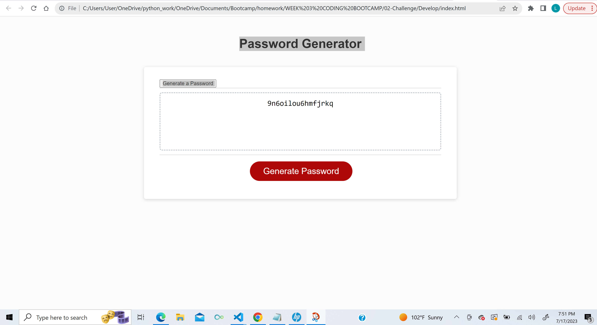

# Password Generator 

## Description:

Created a working password generator that took in user input through a series of prompts.

## Screenshot:

## Link to App
[link](https://lwalker107.github.io/Password-Generator-Landen/)

## Tutor Help

For this assignment, lines 101-105 I used this article on how to randomize the characters in the list for the password generation since I had a lot of trouble figuring out how to do this. The link (dev.to/code_mystery/random-password-generator-using-javascript-6a). I also got help from Ask.BCS on how the logic worked on those lines as well (got help from Sebastian).